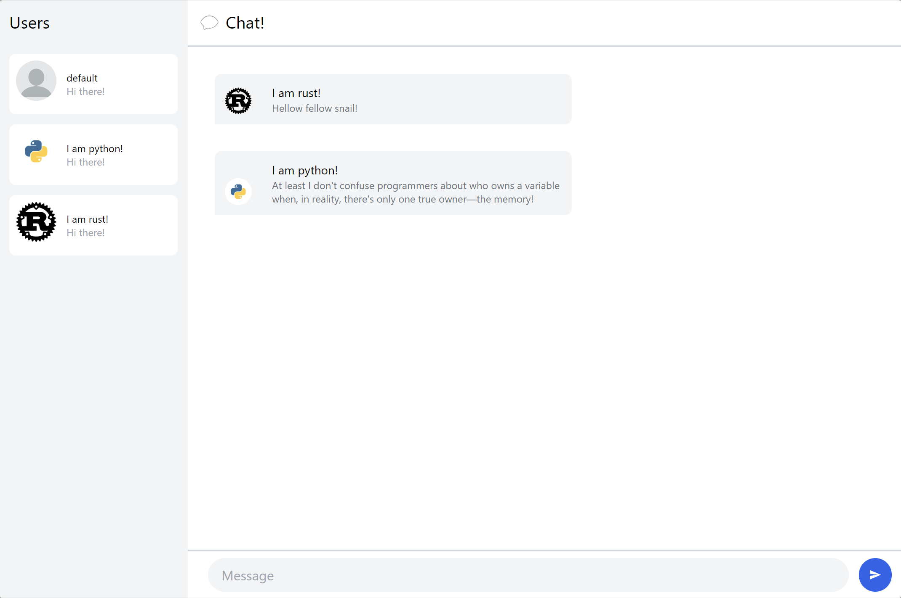

# 3.1. Original code


# Experiment 3.2: Be Creative!



Pada bab ini saya fokus mengembangan agar user bisa menginputkan link gambar profile picture yang akan dirender oleh aplikasi. Saya membuat library `coding.rs` untuk mengontrol encoding `USERNAME===IMAGEURL` agar tetap menggunakan string tidak merubah sebagian besar kode. Pendekatan ini membuat username tidak boleh mendaung = atau akan terjadi parsing yang salah. 

```rust
pub fn get_username(s: &str) -> String {
    s.split("===").next().unwrap_or("").to_string()
}
pub fn get_image(s: &str) -> String {
    s.splitn(2, "===").nth(1).unwrap_or("").to_string()
}
pub fn set_username(s: &str, new_before: &str) -> String {
    let after = get_image(s);
    format!("{}==={}", new_before, after)
}
pub fn set_image(s: &str, new_after: &str) -> String {
    let before = get_username(s);
    format!("{}==={}", before, new_after)
}
```

Setelah itu pada main akan dibuat username dan image default 
`let username = use_state(|| format!("Default===https://cdn.pixabay.com/photo/2015/10/05/22/37/blank-profile-picture-973460_960_720.png"));`
Oninput username untuk menangani event input username juga diubah untuk memodifikasi hanya merupah username pada variabel `username`
```rust
let oninput_username = { // update
        let current_username = username.clone();

        Callback::from(move |e: InputEvent| {
            let input: HtmlInputElement = e.target_unchecked_into();
            let encoded_username = format!("{}==={}", input.value(), get_image(&current_username));
            current_username.set(encoded_username);
        })
    };
```
Ditambahkan oninput_image untuk menghandle input url image yang akan dibuat.
```rust
let oninput_image = { // update
        let current_username = username.clone();

        Callback::from(move |e: InputEvent| {
            let input: HtmlInputElement = e.target_unchecked_into();
            let encoded_username = format!("{}==={}", get_username(&current_username), input.value());
            current_username.set(encoded_username);
        })
    };
```
Penambahan input pada html login page setelah input username
`<input value={get_image(&username)} oninput={oninput_image} class="p-4 border-t mr-0 border-b border-l text-gray-800 border-gray-200 bg-white" placeholder="Profile Picture URL" />`
Pada `chat.rs`, perlu dibedakan kapan merender image dan kapan merender text. Untuk setiap render text username, dimodifikasi menjadi `{get_username(&m.from)}` untuk mendapatkan username saja. Untuk url image, menjadi `src={get_image(&user.name)}` untuk hanya mengambil url saja dari 'USERNAME===URL' yang sudah didefinisikan. Banyak kode yang bad practice sebenarnya yang saya buat. Alasan utamanya adalah saya membuat ini untuk mendapatkan modifikasi sesedikit mungkin sehingga perlu memaksimalisasi kompatibilitas dengan kode yang sudah ada.